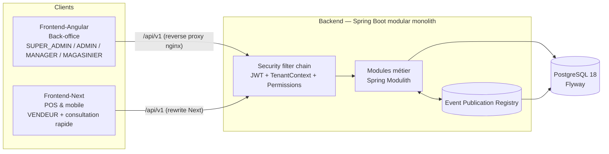
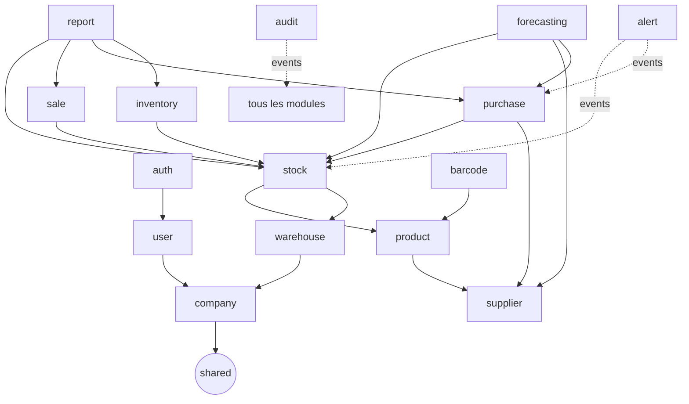
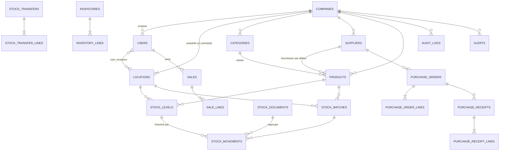

# StockHub — Phase 0 : Audit et plan d'implémentation

> Document de référence. Toute décision architecturale fondamentale qui s'en écarte doit être justifiée dans `docs/adr/`.

---

## 0. Audit de l'environnement (2026-09-21)

| Outil | Disponible | Choix StockHub |
|---|---|---|
| JDK | 8, 11, 17, 21, 25 | **Java 21 LTS** (Maven tourne déjà sur 21 ; images `eclipse-temurin:21`) |
| Maven | 3.9.12 | Maven Wrapper `mvnw` commité |
| Node / npm | 22.21.1 / 10.9.4 | npm (pas de pnpm installé) |
| Angular CLI | 21.2.18 (global) | **Angular 21.2** + PrimeNG 21.1 — voir ajustement Phase 1 ci-dessous |
| Docker / Compose | 29.1 / 2.40 | `docker compose` v2 |
| PostgreSQL | 18.6 (local) | Image **postgres:18-alpine** |

Versions stables retenues (vérifiées sur Maven Central / npm) :

| Brique | Version |
|---|---|
| Spring Boot | 4.1.1 |
| Spring Modulith | 2.1.1 |
| springdoc-openapi | 3.1.1 |
| JJWT | 0.13.0 |
| ArchUnit | 1.5.0 |
| Apache POI (Excel) | 5.5.1 |
| OpenPDF (PDF) | 3.0.5 |
| ZXing (codes-barres) | 3.5.4 |
| Testcontainers | via BOM Spring Boot |
| Angular / PrimeNG / @primeuix/themes | 21.2 / 21.1 / 3.0 |
| Next.js / React | 16.3.x / 19.x |
| Tailwind CSS | 4.3 |
| TanStack Query / Zustand | 5.10x / 5.0.x |
| next-intl | 4.14 |
| Playwright | 1.63 |

**Ajustements décidés en Phase 1** :
- Angular 22 exige Node ≥ 22.22.3 ; la machine a Node 22.21.1. Pour ne pas imposer une mise à jour de l'environnement, le back-office utilise **Angular 21.2 + PrimeNG 21.1** (versions stables, supportées). Les images Docker et la CI utilisent Node 24. La montée vers Angular 22 est une simple commande `ng update` ultérieure.
- npm 10.9 contient un bug d'arborist (`edgesOut`) avec les dépendances pair de Vitest 4 : les installations ont été faites avec `npx npm@11`. Les lockfiles sont compatibles avec `npm ci` sous npm 10 et 11.
- Registre d'événements Spring Modulith : **implémentation JDBC** (schéma v2 versionné dans Flyway `V1`) plutôt que JPA, afin que le schéma soit entièrement contrôlé par Flyway.
- Tailwind Plus (payant) remplacé par **Headless UI + Heroicons** (validé par le porteur du projet).

**Conflits de ports détectés** : un autre projet (`gds_*`) occupe 4200, 3009, 8089, 5436, 8081.
Ports StockHub : **Backend 8080 · Angular 4300 · Next 3100 · PostgreSQL 5440**.

---

## 1. Architecture finale proposée



### Principes structurants

1. **Monolithe modulaire** : un seul déployable, 16 modules métier dont les frontières sont vérifiées par `ApplicationModules.verify()` (Modulith) et ArchUnit.
2. **Clean Architecture dans chaque module** : `domain` (Java pur) ← `application` (use cases, ports) ← `infrastructure` (JPA, adapters) / `presentation` (REST). Le domaine n'importe ni Spring, ni Jakarta Persistence.
3. **Entités JPA ≠ modèle de domaine** : les entités JPA vivent dans `infrastructure/persistence` et sont converties par des mappers. Les DTO REST vivent dans `presentation`.
4. **Communication inter-modules** :
   - *appel synchrone* via l'API publique d'un module (package racine du module, ex. `stock.StockOperations`) quand l'atomicité est requise (vente → décrément stock, réception → entrée stock, validation inventaire → ajustements) ;
   - *événements* (`@ApplicationModuleListener`, après commit, persistés dans l'Event Publication Registry JDBC) pour les effets secondaires : audit, alertes, statistiques.
   - Jamais d'accès au repository d'un autre module.
5. **Multi-tenant en schéma partagé** : colonne `company_id` sur toutes les ressources métier ; l'entreprise courante vient **exclusivement** du JWT (`TenantContext`), jamais du body/query. Une ressource d'une autre entreprise renvoie **404** (pas 403) pour ne pas révéler son existence.
6. **Stock = registre immuable + soldes verrouillés** : `stock_movements` (append-only, protégé par trigger) est la vérité historique ; `stock_levels` et `stock_batches` sont des soldes matérialisés mis à jour dans la **même transaction** que le mouvement.

### Décisions techniques (ADR résumées)

| # | Décision | Justification |
|---|---|---|
| ADR-01 | Identifiants **UUID v7** générés côté application | Non énumérables (isolation), triables dans le temps, indexables |
| ADR-02 | Access token JWT **15 min** (HS512, en mémoire côté front) + refresh token **opaque 7 j**, haché SHA-256 en base, **rotation + détection de réutilisation**, transporté en cookie `HttpOnly; Secure; SameSite=Strict; Path=/api/v1/auth` | Révocable, résistant au vol XSS du refresh |
| ADR-03 | Les deux fronts appellent l'API **en same-origin** (proxy nginx pour Angular, rewrites Next) | Cookies SameSite=Strict fonctionnels, pas de CORS permissif en prod |
| ADR-04 | Le JWT ne porte que `sub`, `cid` (company), `tv` (token version). **Permissions et emplacements rechargés côté serveur** (cache Caffeine 60 s, invalidé à chaque changement de rôle) | Ne jamais faire confiance à des droits transportés ; désactivation = effet immédiat via `tv` |
| ADR-05 | Mots de passe : **Argon2id** (`DelegatingPasswordEncoder`) | Recommandation OWASP |
| ADR-06 | Concurrence stock : **verrou pessimiste court** (`SELECT … FOR UPDATE`) sur `stock_levels`/`stock_batches`, acquis **triés par (location, product, batch)** pour éviter les deadlocks ; `@Version` (optimistic) sur documents (commande, inventaire, produit, entreprise) | Sur un POS, un échec optimiste = vente perdue ; le verrou court sérialise proprement. Les documents éditables relèvent de l'optimistic → 409 |
| ADR-07 | **Stock négatif interdit** par défaut ; paramètre entreprise `allow_negative_stock` (false) vérifié dans le domaine | Exigence §31 |
| ADR-08 | Numérotation : table `document_sequences(company_id, type, year)` incrémentée par `UPDATE … RETURNING` dans la transaction | Unicité et absence de trous en concurrence ; + contrainte UNIQUE en filet de sécurité |
| ADR-09 | Quantités `numeric(19,3)` + unité de mesure (`UNIT, KG, G, L, ML, M, BOX, PACK`) ; montants `numeric(19,4)` + devise entreprise (ISO 4217, défaut **XAF**) | Produits vrac réalistes, pas d'erreur flottante |
| ADR-10 | `stock_movements` et `audit_logs` : **append-only** (trigger PostgreSQL rejetant UPDATE/DELETE) | Traçabilité garantie même en cas de bug applicatif |
| ADR-11 | Soft delete (`active`, `deleted_at`) sur produits, catégories, fournisseurs, emplacements, utilisateurs ; unicité via index partiels `WHERE deleted_at IS NULL` | Historique préservé |
| ADR-12 | Rôles **système fixes** en MVP, liés à des permissions via `role_permissions` (seedé par Flyway) ; les contrôles se font sur les **permissions** (`@PreAuthorize("hasAuthority('PRODUCT_CREATE')")`) + `LocationAccessPolicy` | Extensible vers des rôles personnalisés en V2 sans toucher au code |
| ADR-13 | SUPER_ADMIN n'a **pas** d'entreprise ; une intervention dans une entreprise passe par une **session support** explicite (motif obligatoire, durée 30 min, lecture seule par défaut), entièrement auditée | Exigence §3 |
| ADR-14 | i18n Angular : **@ngx-translate** (changement de langue à chaud, un seul build) ; Next : **next-intl** | Changement de langue sans rechargement ni builds multiples |
| ADR-15 | Graphiques : Chart.js via PrimeNG (Angular), Recharts (Next) | Écosystème natif de chaque framework, thémables par tokens |
| ADR-16 | Scan : API `BarcodeDetector` si disponible, sinon `@zxing/browser` ; scanner physique détecté comme saisie clavier rapide terminée par Entrée | Couverture Android/iOS/desktop |
| ADR-17 | **Tailwind Plus** est un produit sous licence payante : les composants Next seront construits sur **Headless UI + Heroicons** (la base open source de Tailwind Plus) en reprenant ses patterns. Si une licence existe, ses blocs pourront remplacer ceux de `shared/ui` sans toucher aux features | Aucun code propriétaire non licencié dans le dépôt |

---

## 2. Arborescence cible

```text
StockHub/
├── README.md
├── docker-compose.yml
├── docker-compose.override.yml.example
├── .env.example
├── .gitignore
├── .editorconfig
├── .github/workflows/
│   ├── backend.yml
│   ├── frontend-angular.yml
│   ├── frontend-next.yml
│   └── e2e.yml
├── docs/
│   ├── 00-architecture-plan.md          (ce document)
│   ├── 01-architecture.md
│   ├── 02-modules.md                    (généré en partie par Modulith Documenter)
│   ├── 03-data-model.md
│   ├── 04-security.md
│   ├── 05-flows.md                      (auth, entrée, vente, commande, inventaire)
│   ├── 06-forecasting.md
│   ├── 07-testing.md
│   ├── adr/
│   └── backlog.md
├── e2e/                                  (Playwright : parcours bout-en-bout multi-apps)
│   ├── package.json
│   ├── playwright.config.ts
│   └── tests/
│
├── Backend/
│   ├── Dockerfile
│   ├── pom.xml
│   ├── mvnw, .mvn/
│   └── src/
│       ├── main/
│       │   ├── java/com/stockhub/
│       │   │   ├── StockHubApplication.java
│       │   │   ├── shared/
│       │   │   │   ├── domain/        (Money, Quantity, UnitOfMeasure, DomainException, TenantId…)
│       │   │   │   ├── application/   (PageQuery, PageResult, Clock port, UseCase marker)
│       │   │   │   ├── security/      (CurrentUser, TenantContext, Permission enum, LocationAccessPolicy)
│       │   │   │   ├── sequence/      (DocumentNumberGenerator)
│       │   │   │   ├── web/           (GlobalExceptionHandler, ApiError, RequestIdFilter)
│       │   │   │   └── infrastructure/(JPA base, UUIDv7, OpenAPI, Jackson, logging config)
│       │   │   ├── auth/
│       │   │   ├── company/
│       │   │   ├── user/
│       │   │   ├── warehouse/         (Location)
│       │   │   ├── product/           (Product, Category, import CSV/Excel)
│       │   │   ├── supplier/
│       │   │   ├── stock/             (StockLevel, Batch, Movement, Transfer, StockDocument)
│       │   │   ├── inventory/
│       │   │   ├── purchase/
│       │   │   ├── sale/
│       │   │   ├── barcode/
│       │   │   ├── alert/
│       │   │   ├── audit/
│       │   │   ├── report/
│       │   │   └── forecasting/
│       │   │       (chaque module :)
│       │   │       ├── <Module>Api.java               ← API publique (interface) exposée aux autres modules
│       │   │       ├── package-info.java              ← @ApplicationModule(allowedDependencies = …)
│       │   │       ├── domain/{model,valueobject,repository,service,event,exception}
│       │   │       ├── application/{command,query,usecase,dto,port}
│       │   │       ├── infrastructure/{persistence,mapper,config}
│       │   │       └── presentation/{controller,request,response}
│       │   └── resources/
│       │       ├── application.yml
│       │       ├── application-dev.yml
│       │       ├── application-test.yml
│       │       ├── application-prod.yml
│       │       ├── db/migration/          (V1__…sql → Vn__…sql)
│       │       ├── db/seed-dev/           (R__demo_data.sql, profil dev uniquement)
│       │       └── i18n/messages_{fr,en}.properties   (messages d'erreur API)
│       └── test/java/com/stockhub/
│           ├── architecture/  (ModularityTests, CleanArchitectureTests)
│           ├── support/       (AbstractIntegrationTest + Testcontainers, fixtures, JwtTestHelper)
│           └── <module>/{domain,application,infrastructure,presentation}
│
├── Frontend-Angular/
│   ├── Dockerfile  (build → nginx, proxy /api → backend)
│   ├── nginx.conf
│   ├── angular.json, package.json, tsconfig*.json (strict), eslint.config.js
│   ├── public/i18n/{fr,en}.json
│   └── src/
│       ├── styles.css            (Tailwind 4 + tokens CSS light/dark)
│       ├── environments/
│       └── app/
│           ├── app.config.ts, app.ts
│           ├── core/
│           │   ├── config/{routes/{app.routes.ts,api.routes.ts}, permissions/, theme/, environment/}
│           │   ├── auth/        (AuthStore signals, session, token refresh)
│           │   ├── guards/      (auth, permission, guest, company-scope)
│           │   ├── interceptors/(auth, refresh-401, error, request-id, locale)
│           │   ├── errors/      (ErrorMapper, GlobalErrorHandler)
│           │   ├── i18n/
│           │   ├── logging/
│           │   └── layout/      (shell, sidebar, topbar, breadcrumbs)
│           ├── shared/
│           │   ├── ui/          (Button, Input, Select, Textarea, Checkbox, Radio, Modal, ConfirmDialog,
│           │   │                 DataTable, Pagination, Badge, Alert, Toast, Skeleton, EmptyState,
│           │   │                 DatePicker, FileUpload, SearchField, StatusBadge, PageHeader,
│           │   │                 PeriodPicker, LocationSelector, MoneyPipe, QuantityPipe…)
│           │   ├── pages/       (forbidden-403, not-found-404, server-error-500)
│           │   └── utils/
│           └── features/
│               └── <feature>/{data/{datasources,models,mappers,repositories},
│                              domain/{entities,repositories,use-cases},
│                              presentation/{pages,components,forms,state}}
│
└── Frontend-Next/
    ├── Dockerfile  (output: standalone)
    ├── next.config.ts (rewrites /api → backend), package.json, tsconfig.json (strict), eslint.config.mjs
    ├── messages/{fr,en}.json
    └── src/
        ├── app/
        │   ├── [locale]/
        │   │   ├── (auth)/login/page.tsx
        │   │   ├── (app)/layout.tsx          (garde session + shell mobile)
        │   │   ├── (app)/pos/page.tsx
        │   │   ├── (app)/scan/page.tsx
        │   │   ├── (app)/products/page.tsx, [id]/page.tsx
        │   │   ├── (app)/sales/page.tsx, [id]/page.tsx
        │   │   ├── (app)/settings/page.tsx
        │   │   ├── forbidden/page.tsx
        │   │   ├── not-found.tsx, error.tsx
        │   └── globals.css (Tailwind 4 + tokens)
        ├── middleware.ts                     (locale + redirection session)
        ├── core/
        │   ├── config/{routes/{app.routes.ts,api.routes.ts}, permissions/, theme/, env.ts}
        │   ├── api/        (httpClient fetch + refresh + ApiError)
        │   ├── auth/       (session provider, usePermission)
        │   ├── i18n/       (next-intl config)
        │   ├── query/      (QueryClient provider)
        │   └── logging/
        ├── shared/
        │   ├── ui/         (mêmes composants, implémentation React/Headless UI indépendante)
        │   └── utils/
        └── features/
            └── <feature>/{data/{datasources,models,mappers,repositories},
                           domain/{entities,repositories,use-cases},
                           presentation/{views,components,hooks,state}}
```

---

## 3. Modules backend et dépendances



Tous dépendent de `shared` (module *OPEN* limité au noyau technique ; aucune logique métier).

| Module | Responsabilité | API publique exposée | Événements publiés |
|---|---|---|---|
| **shared** | Value objects (Money, Quantity), sécurité transverse, erreurs, pagination, numérotation | `DocumentNumberGenerator`, `CurrentUserProvider` | — |
| **company** | Entreprises, paramètres (devise, timezone, stock négatif, seuil expiration) | `CompanyApi` (settings, statut actif) | `CompanyCreated`, `CompanyStatusChanged`, `CompanySettingsUpdated` |
| **user** | Utilisateurs, rôles, permissions, emplacements autorisés, mot de passe | `UserDirectory` (chargement des autorités) | `UserCreated`, `UserRoleChanged`, `UserStatusChanged`, `PasswordChanged` |
| **auth** | Login, refresh (rotation), logout, me, sessions support | — | `UserLoggedIn`, `LoginFailed`, `RefreshTokenReuseDetected`, `SupportSessionOpened` |
| **warehouse** | Emplacements (STORE/WAREHOUSE/DEPOT), emplacement principal | `LocationApi` | `LocationCreated`, `LocationUpdated` |
| **product** | Produits, catégories, import CSV/Excel | `ProductCatalog` (lookup, prix, flags lot/expiration, seuil) | `ProductCreated`, `ProductUpdated`, `ProductPriceChanged`, `ProductDeactivated` |
| **supplier** | Fournisseurs, contacts, lead time | `SupplierApi` | `SupplierCreated/Updated` |
| **stock** | Soldes, lots, mouvements, entrées/sorties, ajustements, transferts, bons BE/BS, FEFO | `StockOperations` (synchrone, transactionnel), `StockQueries` | `StockMovementRecorded`, `StockLevelChanged`, `StockTransferred`, `StockDocumentIssued` |
| **inventory** | Inventaires physiques, comptages, validation → ajustements | — | `InventoryValidated`, `InventoryCancelled` |
| **purchase** | Commandes fournisseurs, réceptions partielles | `PurchaseQueries` (quantités en commande pour forecasting) | `PurchaseOrderValidated`, `PurchaseOrderReceived`, `PurchaseOrderCancelled` |
| **sale** | Ventes POS, annulation, reçus | `SaleQueries` (reporting) | `SaleCompleted`, `SaleCancelled` |
| **barcode** | Génération (CODE128, EAN-13 + clé de contrôle), rendu PNG/SVG, planches d'étiquettes PDF | — | `BarcodeAssigned` |
| **alert** | LOW_STOCK, OUT_OF_STOCK, EXPIRING_SOON, EXPIRED, PURCHASE_ORDER_DELAYED ; statuts UNREAD/READ/RESOLVED ; job planifié quotidien | — | `AlertRaised` |
| **audit** | Journal immuable (qui/quoi/quand/ressource/entreprise/IP/avant/après) | `AuditRecorder` (usage direct pour actions sensibles non événementielles) | — |
| **report** | Dashboard, KPIs par période, exports Excel/PDF (lecture seule, requêtes SQL projetées) | — | — |
| **forecasting** | Consommation moyenne, couverture, stock de sécurité, point de commande, quantité suggérée, date de rupture | `ForecastModel` (stratégie) | — |

**Règle d'atomicité** : vente, réception, transfert, validation d'inventaire et ajustement s'exécutent dans **une seule transaction** qui appelle `StockOperations` de façon synchrone. Audit et alertes réagissent aux événements **après commit** (garantie de livraison par l'Event Publication Registry, republication au redémarrage). Les actions d'audit de sécurité critiques (connexion échouée, réutilisation de refresh token) sont écrites directement.

---

## 4. Features Angular (back-office)

| Feature | Écrans principaux | Rôles |
|---|---|---|
| `auth` | Login, changement mot de passe, session expirée | tous |
| `platform` | Liste/création/édition/activation entreprises + 1er ADMIN, stats globales, audit global, paramètres plateforme, session support | SUPER_ADMIN |
| `dashboard` | KPIs, graphiques période, stock par emplacement, alertes récentes, top sorties | ADMIN, MANAGER, MAGASINIER (vue réduite) |
| `users` | Liste filtrable, création, édition, rôle, emplacements, activation, reset mot de passe | ADMIN |
| `locations` | Emplacements, principal, activation | ADMIN (MANAGER lecture) |
| `categories` | CRUD arborescence simple (parent optionnel) | ADMIN, MANAGER |
| `products` | Liste (recherche avancée), fiche, formulaire, image, génération/impression code-barres, import CSV/Excel avec prévisualisation | ADMIN, MANAGER, MAGASINIER (lecture + codes-barres) |
| `suppliers` | CRUD, contacts, délai de livraison | ADMIN, MANAGER |
| `stock` | Soldes par emplacement, lots, expirations (FEFO), entrée, sortie, ajustement, historique des mouvements, bons BE/BS (PDF) | ADMIN, MANAGER, MAGASINIER |
| `transfers` | Création et historique des transferts (masqué si 1 emplacement) | ADMIN, MANAGER, MAGASINIER |
| `inventories` | Création, comptage (saisie + scan), écarts, clôture, validation | ADMIN, MANAGER (validation), MAGASINIER (comptage) |
| `purchase-orders` | Liste, création multi-lignes, validation, envoi, réception partielle avec lots, bon d'entrée | ADMIN, MANAGER, MAGASINIER (réception) |
| `sales` | Consultation des ventes, détail, annulation (autorisée) | ADMIN, MANAGER |
| `alerts` | Centre d'alertes, lu/résolu, badge topbar | tous sauf SUPER_ADMIN |
| `audit` | Journal filtrable (utilisateur, action, entité, période), diff avant/après | ADMIN (SUPER_ADMIN : global) |
| `reports` | Rapports stock/mouvements/inventaires/commandes/ventes, export Excel & PDF | ADMIN, MANAGER |
| `forecasting` | Tableau de réapprovisionnement, explication du calcul, création PO depuis suggestions | ADMIN, MANAGER |
| `settings` | Paramètres entreprise, profil, thème, langue | ADMIN / tous (profil) |

## 5. Features Next.js (vendeur / mobile-first)

| Feature | Écrans | Rôles |
|---|---|---|
| `auth` | Login, session | tous sauf SUPER_ADMIN |
| `pos` | Caisse : recherche, scan, panier (Zustand persisté par session), quantités, stock disponible en temps réel, paiement (espèces/carte/mobile money, rendu monnaie), validation, reçu imprimable | VENDEUR, MANAGER, ADMIN |
| `scanner` | Scan caméra plein écran + scanner physique, fiche produit rapide | tous |
| `products` | Catalogue recherche/filtre, disponibilité par emplacement | tous |
| `sales` | Historique personnel (VENDEUR), détail, réimpression reçu | VENDEUR (ses ventes), MANAGER/ADMIN (toutes) |
| `settings` | Emplacement de caisse, thème, langue, profil | tous |

---

## 6. Modèle de données initial

Colonnes communes (sauf tables immuables) : `id uuid PK`, `created_at`, `updated_at`, `created_by`, `updated_by`, `version bigint` (optimistic locking là où indiqué 🔒).

| Table | Colonnes principales | Contraintes / index |
|---|---|---|
| **companies** 🔒 | name, legal_name, email, phone, address_line, city, country, currency (ISO), timezone, locale, status (ACTIVE/DISABLED), allow_negative_stock, expiry_warning_days (30), default_safety_days | UNIQUE(lower(name)) |
| **users** 🔒 | company_id (NULL pour SUPER_ADMIN), email, password_hash, first_name, last_name, phone, role, all_locations bool, status (ACTIVE/DISABLED), must_change_password, token_version, last_login_at, deleted_at | UNIQUE(lower(email)) WHERE deleted_at IS NULL ; CHECK (role='SUPER_ADMIN') = (company_id IS NULL) |
| **roles** | code (PK), label_key, is_platform | seed |
| **permissions** | code (PK), module | seed |
| **role_permissions** | role_code, permission_code | PK composite |
| **user_locations** | user_id, location_id | PK composite |
| **refresh_tokens** | user_id, token_hash, family_id, expires_at, revoked_at, replaced_by, created_ip, user_agent | UNIQUE(token_hash), index(family_id) |
| **support_sessions** | super_admin_id, company_id, reason, read_only, expires_at, closed_at | |
| **locations** 🔒 | company_id, code, name, type (STORE/WAREHOUSE/DEPOT), address, is_primary, active, deleted_at | UNIQUE(company_id, code) ; UNIQUE(company_id) WHERE is_primary |
| **categories** 🔒 | company_id, name, description, parent_id, active, deleted_at | UNIQUE(company_id, lower(name)) WHERE deleted_at IS NULL |
| **suppliers** 🔒 | company_id, code, name, contact_name, email, phone, address, tax_id, lead_time_days, notes, active, deleted_at | UNIQUE(company_id, code) |
| **products** 🔒 | company_id, sku, barcode, barcode_format, name, description, category_id, default_supplier_id, unit, purchase_price, sale_price, min_stock, reorder_qty, batch_tracked, expiry_tracked, image_path, active, deleted_at | UNIQUE(company_id, sku), UNIQUE(company_id, barcode) WHERE barcode IS NOT NULL ; index trigram sur name (pg_trgm) ; CHECK prix ≥ 0 ; CHECK expiry_tracked ⇒ batch_tracked |
| **stock_levels** 🔒 | company_id, location_id, product_id, quantity, reserved_quantity, last_movement_at | UNIQUE(company_id, location_id, product_id) |
| **stock_batches** 🔒 | company_id, location_id, product_id, batch_number, manufactured_at, expires_at, unit_cost, quantity, status (ACTIVE/EXPIRED/DEPLETED/QUARANTINED) | UNIQUE(company_id, location_id, product_id, batch_number) ; index(expires_at) |
| **stock_movements** (immuable) | company_id, location_id, product_id, batch_id, type, quantity (signée), quantity_before, quantity_after, unit_cost, reason, reference_type (SALE/PO/INVENTORY/TRANSFER/MANUAL), reference_id, document_id, transfer_group_id, user_id, occurred_at | index(company_id, product_id, occurred_at), index(company_id, location_id, occurred_at), index(reference_type, reference_id) ; trigger anti UPDATE/DELETE |
| **stock_documents** | company_id, location_id, type (ENTRY_NOTE/EXIT_NOTE), number (BE-2026-000001), reason, reference_type, reference_id, user_id, issued_at | UNIQUE(company_id, number) |
| **stock_transfers** | company_id, number (TR-…), from_location_id, to_location_id, status (COMPLETED/CANCELLED), reason, user_id, transferred_at | CHECK from ≠ to |
| **stock_transfer_lines** | transfer_id, product_id, batch_id, quantity | |
| **inventories** 🔒 | company_id, number (INV-…), location_id, status (DRAFT/IN_PROGRESS/COMPLETED/VALIDATED/CANCELLED), scope (FULL/PARTIAL), started_at, completed_at, validated_at, validated_by, notes | |
| **inventory_lines** 🔒 | inventory_id, product_id, batch_id, expected_quantity (figé au démarrage), counted_quantity, difference (générée), counted_by, counted_at, comment | UNIQUE(inventory_id, product_id, batch_id) |
| **purchase_orders** 🔒 | company_id, number (PO-…), supplier_id, location_id, status (DRAFT/VALIDATED/ORDERED/PARTIALLY_RECEIVED/RECEIVED/CANCELLED), expected_at, ordered_at, total_amount, notes, validated_by | |
| **purchase_order_lines** 🔒 | order_id, product_id, ordered_quantity, received_quantity, unit_price, line_total | CHECK received ≤ ordered |
| **purchase_receipts** | order_id, company_id, document_id (BE), received_by, received_at, idempotency_key | UNIQUE(idempotency_key) |
| **purchase_receipt_lines** | receipt_id, order_line_id, quantity, batch_number, expires_at, manufactured_at | |
| **sales** 🔒 | company_id, number (SALE-…), location_id, seller_id, status (COMPLETED/CANCELLED), subtotal, total, payment_method, amount_paid, change_due, cancelled_at, cancelled_by, cancel_reason, idempotency_key | UNIQUE(company_id, idempotency_key) |
| **sale_lines** | sale_id, product_id, batch_id, quantity, unit_price, line_total | |
| **alerts** | company_id, location_id, product_id, batch_id, purchase_order_id, type, severity, status (UNREAD/READ/RESOLVED), message_key, params jsonb, raised_at, resolved_at, resolved_by, dedup_key | UNIQUE(dedup_key) WHERE status <> 'RESOLVED' |
| **audit_logs** (immuable) | company_id, user_id, actor_email, action, entity_type, entity_id, old_value jsonb, new_value jsonb, ip_address, user_agent, request_id, support_session_id, occurred_at | index(company_id, occurred_at), index(entity_type, entity_id) ; trigger anti UPDATE/DELETE |
| **document_sequences** | company_id, doc_type, year, last_value | PK(company_id, doc_type, year) |
| **import_jobs** | company_id, type, file_name, status (PREVIEWED/COMMITTED/REJECTED), total_rows, error_rows, report jsonb, user_id | |
| **event_publication** | table Spring Modulith | |

### Relations



**Invariants garantis** :
- `stock_levels.quantity = Σ stock_movements.quantity` pour (location, product) — vérifié par test d'intégration et endpoint de contrôle de cohérence (`/stock/consistency-check`, ADMIN).
- Pour un produit suivi par lot : `stock_levels.quantity = Σ stock_batches.quantity` à l'emplacement.
- `quantity ≥ 0` sauf si `allow_negative_stock` (et jamais pour un lot).
- Un transfert produit exactement une paire TRANSFER_OUT / TRANSFER_IN de même `transfer_group_id`, dans la même transaction.

---

## 7. Matrice rôles / permissions

Légende : ✅ accordé · 📍 accordé mais limité aux emplacements autorisés de l'utilisateur · 👤 limité à ses propres données · — refusé

| Permission | SUPER_ADMIN | ADMIN | MANAGER | MAGASINIER | VENDEUR |
|---|:-:|:-:|:-:|:-:|:-:|
| PLATFORM_STATS_VIEW, PLATFORM_SETTINGS_MANAGE, SUPPORT_SESSION_OPEN | ✅ | — | — | — | — |
| COMPANY_VIEW | ✅ (toutes) | ✅ (la sienne) | ✅ (la sienne) | — | — |
| COMPANY_CREATE / COMPANY_DISABLE | ✅ | — | — | — | — |
| COMPANY_UPDATE | ✅ | ✅ (paramètres) | — | — | — |
| USER_VIEW | ✅ (admins) | ✅ | ✅ (lecture) | — | — |
| USER_CREATE / USER_UPDATE / USER_DISABLE | ✅ (1er ADMIN) | ✅ ¹ | — | — | — |
| WAREHOUSE_VIEW | — | ✅ | 📍 | 📍 | 📍 |
| WAREHOUSE_CREATE / WAREHOUSE_UPDATE | — | ✅ | — | — | — |
| CATEGORY_VIEW | — | ✅ | ✅ | ✅ | ✅ |
| CATEGORY_MANAGE | — | ✅ | ✅ | — | — |
| PRODUCT_VIEW | — | ✅ | ✅ | ✅ | ✅ |
| PRODUCT_CREATE / PRODUCT_UPDATE | — | ✅ | ✅ | — | — |
| PRODUCT_DELETE (soft) / PRODUCT_IMPORT | — | ✅ | ✅ | — | — |
| BARCODE_GENERATE / BARCODE_PRINT | — | ✅ | ✅ | ✅ | — |
| SUPPLIER_VIEW | — | ✅ | ✅ | ✅ | — |
| SUPPLIER_CREATE / SUPPLIER_UPDATE | — | ✅ | ✅ | — | — |
| STOCK_VIEW | — | ✅ | 📍 | 📍 | 📍 (disponibilité) |
| STOCK_ENTRY / STOCK_EXIT | — | ✅ | 📍 | 📍 | — |
| STOCK_ADJUST | — | ✅ | 📍 | — ² | — |
| STOCK_TRANSFER | — | ✅ | 📍 | 📍 (origine et destination autorisées) | — |
| BATCH_MANAGE | — | ✅ | 📍 | 📍 | — |
| INVENTORY_VIEW | — | ✅ | 📍 | 📍 | — |
| INVENTORY_CREATE / INVENTORY_COUNT | — | ✅ | 📍 | 📍 | — |
| INVENTORY_VALIDATE | — | ✅ | 📍 | — ³ | — |
| PURCHASE_ORDER_VIEW | — | ✅ | ✅ | 📍 | — |
| PURCHASE_ORDER_CREATE | — | ✅ | ✅ | — | — |
| PURCHASE_ORDER_VALIDATE | — | ✅ | ✅ | — | — |
| PURCHASE_ORDER_RECEIVE | — | ✅ | 📍 | 📍 | — |
| SALE_CREATE | — | ✅ | 📍 | — | 📍 |
| SALE_VIEW | — | ✅ | 📍 | — | 👤 |
| SALE_CANCEL | — | ✅ | 📍 | — | — |
| RECEIPT_REPRINT | — | ✅ | ✅ | — | 👤 |
| ALERT_VIEW / ALERT_MANAGE | — | ✅ | 📍 | 📍 | — |
| REPORT_VIEW | ✅ (global) | ✅ | ✅ | 📍 (stock) | — |
| REPORT_EXPORT | — | ✅ | ✅ | — | — |
| FORECAST_VIEW | — | ✅ | ✅ | — | — |
| AUDIT_VIEW | ✅ (global) | ✅ | — | — | — |

¹ Un ADMIN ne peut attribuer que ADMIN, MANAGER, MAGASINIER, VENDEUR de **sa** société ; il ne peut ni se désactiver ni retirer le dernier ADMIN actif.
² Le magasinier constate les écarts via l'inventaire ; l'ajustement direct est réservé à MANAGER/ADMIN (séparation des tâches).
³ Séparation des tâches : celui qui compte ne valide pas.

Contrôle en 4 couches côté backend : **authentification** (JWT valide, `tv` à jour, utilisateur et entreprise actifs) → **permission** (`@PreAuthorize`) → **tenant** (`companyId` du contexte injecté dans chaque requête de repository) → **emplacement** (`LocationAccessPolicy.check(locationId)` dans les use cases).

---

## 8. Endpoints REST (`/api/v1`)

Conventions : pagination `?page=0&size=20&sort=name,asc`, réponses `PageResponse{content, page, size, totalElements, totalPages}`, erreurs `ApiError{timestamp,status,code,message,path,requestId,fieldErrors[]}`, en-tête `Idempotency-Key` pour ventes et réceptions, `If-Match`/`version` pour les mises à jour optimistic (409 `CONCURRENT_MODIFICATION`).

### Auth
| Méthode | Chemin | Permission |
|---|---|---|
| POST | `/auth/login` | public (rate-limited) |
| POST | `/auth/refresh` | cookie refresh |
| POST | `/auth/logout` | authentifié |
| GET | `/auth/me` | authentifié (profil, entreprise, rôle, permissions, emplacements, paramètres) |
| POST | `/auth/change-password` | authentifié |

### Plateforme (SUPER_ADMIN)
| GET/POST | `/platform/companies` | COMPANY_VIEW / COMPANY_CREATE (crée entreprise + emplacement principal + 1er ADMIN) |
|---|---|---|
| GET/PUT | `/platform/companies/{id}` | COMPANY_VIEW / COMPANY_UPDATE |
| POST | `/platform/companies/{id}/activate` · `/disable` | COMPANY_DISABLE |
| POST | `/platform/companies/{id}/admins` | USER_CREATE |
| GET | `/platform/stats` | PLATFORM_STATS_VIEW |
| GET | `/platform/audit-logs` | AUDIT_VIEW |
| POST/DELETE | `/platform/support-sessions` · `/{id}` | SUPPORT_SESSION_OPEN |

### Entreprise courante
| GET/PUT | `/company` · `/company/settings` | COMPANY_VIEW / COMPANY_UPDATE |
|---|---|---|

### Utilisateurs
| GET/POST | `/users` | USER_VIEW / USER_CREATE |
|---|---|---|
| GET/PUT | `/users/{id}` | USER_VIEW / USER_UPDATE |
| PUT | `/users/{id}/role` · `/users/{id}/locations` | USER_UPDATE |
| POST | `/users/{id}/activate` · `/disable` · `/reset-password` | USER_DISABLE / USER_UPDATE |
| GET | `/roles` (rôles + permissions, lecture) | USER_VIEW |

### Emplacements, catégories, fournisseurs
| GET/POST | `/locations` ; GET/PUT `/locations/{id}` ; POST `/locations/{id}/activate`,`/deactivate`,`/set-primary` | WAREHOUSE_* |
|---|---|---|
| GET/POST | `/categories` ; GET/PUT/DELETE `/categories/{id}` | CATEGORY_* |
| GET/POST | `/suppliers` ; GET/PUT `/suppliers/{id}` ; POST `/suppliers/{id}/activate`,`/deactivate` | SUPPLIER_* |

### Produits & codes-barres
| GET | `/products?q=&sku=&barcode=&categoryId=&supplierId=&locationId=&stockStatus=&belowMin=&active=` | PRODUCT_VIEW |
|---|---|---|
| POST | `/products` ; GET/PUT/DELETE `/products/{id}` ; PUT `/products/{id}/image` | PRODUCT_* |
| GET | `/products/lookup?barcode=` (scan, renvoie produit + stock de l'emplacement courant) | PRODUCT_VIEW |
| POST | `/products/imports/preview` (multipart) · `/products/imports/{jobId}/commit` | PRODUCT_IMPORT |
| POST | `/products/{id}/barcode` (génère et assigne) | BARCODE_GENERATE |
| GET | `/products/{id}/barcode.png\|svg?format=CODE128` | PRODUCT_VIEW |
| POST | `/barcodes/labels` (PDF planche d'étiquettes, lot de produits × quantités) | BARCODE_PRINT |

### Stock
| GET | `/stock/levels?locationId=&productId=&status=&q=` | STOCK_VIEW |
|---|---|---|
| GET | `/stock/levels/by-product/{productId}` (répartition par emplacement) | STOCK_VIEW |
| GET | `/stock/batches?productId=&locationId=&expiresBefore=&status=` | STOCK_VIEW |
| GET | `/stock/batches/fefo?productId=&locationId=&quantity=` (suggestion d'allocation) | STOCK_VIEW |
| GET | `/stock/movements?type=&productId=&locationId=&from=&to=&userId=&reference=` | STOCK_VIEW |
| POST | `/stock/entries` (multi-lignes, lots) → BE | STOCK_ENTRY |
| POST | `/stock/exits` (multi-lignes, motif, FEFO) → BS | STOCK_EXIT |
| POST | `/stock/adjustments` | STOCK_ADJUST |
| POST | `/stock/returns/customer` · `/stock/returns/supplier` | STOCK_ENTRY / STOCK_EXIT |
| GET/POST | `/stock/transfers` ; GET `/stock/transfers/{id}` | STOCK_TRANSFER |
| GET | `/stock/documents?type=` ; GET `/stock/documents/{id}` ; GET `/stock/documents/{id}/pdf` | STOCK_VIEW |
| GET | `/stock/consistency-check` | AUDIT_VIEW |

### Inventaires
| GET/POST | `/inventories` ; GET `/inventories/{id}` | INVENTORY_VIEW / INVENTORY_CREATE |
|---|---|---|
| POST | `/inventories/{id}/start` (fige les quantités attendues) | INVENTORY_CREATE |
| PUT | `/inventories/{id}/lines/{lineId}` · POST `/inventories/{id}/counts` (par scan) | INVENTORY_COUNT |
| POST | `/inventories/{id}/complete` · `/validate` · `/cancel` | INVENTORY_COUNT / INVENTORY_VALIDATE |
| GET | `/inventories/{id}/pdf` · `/inventories/{id}/export.xlsx` | REPORT_EXPORT |

### Commandes fournisseurs
| GET/POST | `/purchase-orders` ; GET/PUT `/purchase-orders/{id}` (DRAFT uniquement) | PURCHASE_ORDER_VIEW / CREATE |
|---|---|---|
| POST | `/purchase-orders/{id}/validate` · `/order` · `/cancel` | PURCHASE_ORDER_VALIDATE |
| POST | `/purchase-orders/{id}/receipts` (réception partielle/totale, lots, `Idempotency-Key`) | PURCHASE_ORDER_RECEIVE |
| GET | `/purchase-orders/{id}/receipts` ; GET `/purchase-orders/{id}/pdf` | PURCHASE_ORDER_VIEW |

### Ventes
| POST | `/sales` (`Idempotency-Key`) | SALE_CREATE |
|---|---|---|
| GET | `/sales?sellerId=&locationId=&from=&to=&status=` (VENDEUR : forcé à ses ventes côté serveur) | SALE_VIEW |
| GET | `/sales/{id}` ; GET `/sales/{id}/receipt` (PDF/ticket) | SALE_VIEW / RECEIPT_REPRINT |
| POST | `/sales/{id}/cancel` | SALE_CANCEL |

### Alertes, audit, rapports, prévisions
| GET | `/alerts?type=&status=&locationId=` ; GET `/alerts/summary` | ALERT_VIEW |
|---|---|---|
| POST | `/alerts/{id}/read` · `/resolve` ; POST `/alerts/read-all` | ALERT_MANAGE |
| GET | `/audit-logs?userId=&action=&entityType=&entityId=&from=&to=` | AUDIT_VIEW |
| GET | `/reports/dashboard?period=7D\|30D\|3M\|1Y\|TODAY\|CUSTOM&from=&to=&locationId=` | REPORT_VIEW |
| GET | `/reports/stock-valuation` · `/movements-summary` · `/top-products` · `/sales-summary` · `/purchases-summary` | REPORT_VIEW |
| GET | `/reports/exports/{products\|stock\|movements\|inventories\|purchase-orders\|batches\|sales}.xlsx` | REPORT_EXPORT |
| GET | `/reports/stock.pdf` · `/reports/summary.pdf` | REPORT_EXPORT |
| GET | `/forecasting/replenishment?locationId=&onlyToOrder=` ; GET `/forecasting/products/{id}` | FORECAST_VIEW |
| POST | `/forecasting/replenishment/purchase-orders` (brouillons de PO par fournisseur) | PURCHASE_ORDER_CREATE |

Techniques : `/actuator/health`, `/actuator/info`, `/actuator/prometheus` (protégé), `/swagger-ui.html`, `/v3/api-docs`.

---

## 9. Règles métier clés

- **Création d'entreprise** (1 transaction) : entreprise + emplacement principal « {Nom} - Principal » (STORE) + 1er ADMIN (`must_change_password = true`) + séquences.
- **Entreprise désactivée** : tous ses utilisateurs sont refusés à l'authentification et au refresh (401 `COMPANY_DISABLED`).
- **Emplacement principal** : exactement un par entreprise ; ne peut être désactivé ; changer le principal est atomique.
- **Produit** : SKU unique par entreprise (auto-généré si vide : `CAT-000123`) ; code-barres unique par entreprise ; `expiry_tracked ⇒ batch_tracked` ; un produit ayant du stock ne peut pas être supprimé (désactivation seulement) ; changer `batch_tracked` interdit si stock > 0.
- **Sortie/vente d'un produit suivi par lot** : allocation **FEFO** automatique (lots non expirés par date d'expiration croissante), lots expirés exclus des ventes ; sortie manuelle d'un lot expiré autorisée avec motif (destruction).
- **Transfert** : origine ≠ destination, deux emplacements actifs de la même entreprise, accès utilisateur aux deux ; lots conservés (numéro/expiration recopiés dans l'emplacement cible).
- **Inventaire** : `start` fige `expected_quantity` ; un seul inventaire IN_PROGRESS par emplacement ; pendant IN_PROGRESS, les mouvements restent possibles et la validation ajuste de `counted − expected − mouvements survenus depuis le démarrage` (écart réel, évite d'écraser les ventes faites pendant le comptage) ; validation = ajustements POSITIVE/NEGATIVE + audit ; double validation impossible (statut + `@Version`).
- **Commande fournisseur** : lignes modifiables en DRAFT uniquement ; réception possible en ORDERED/PARTIALLY_RECEIVED ; `received ≤ ordered` ; statut recalculé ; réception idempotente ; génère BE + mouvements ENTRY + lots ; met à jour le prix d'achat (paramétrable) ; alerte PURCHASE_ORDER_DELAYED si `expected_at` dépassé et non reçu.
- **Vente** : emplacement de vente autorisé ; prix repris **côté serveur** (jamais celui du client) ; stock vérifié sous verrou ; idempotence ; annulation = mouvements RETURN_CUSTOMER vers les lots d'origine + audit, dans la limite configurée (même jour par défaut).
- **Alertes** : recalcul synchrone après commit sur `StockLevelChanged` (LOW_STOCK si `0 < qty ≤ min`, OUT_OF_STOCK si `qty ≤ 0`, résolution automatique quand la condition disparaît) ; job quotidien 02:00 (timezone entreprise) pour EXPIRING_SOON / EXPIRED / PURCHASE_ORDER_DELAYED ; déduplication par `dedup_key`.

## 10. Algorithme de prévision (explicable)

Sur une fenêtre `W` (90 j par défaut, 30 j minimum d'historique sinon « données insuffisantes ») :

```
demande_journalière d_i   = Σ sorties (SALE + EXIT − RETURN_CUSTOMER) du jour i, jours sans mouvement = 0
moyenne  μ                = Σ d_i / W
écart-type σ              = √(Σ (d_i − μ)² / (W − 1))
lead time L               = fournisseur.lead_time_days (défaut entreprise 7)
stock de sécurité SS      = z · σ · √L        (z = 1,65 pour 95 % de service ; plancher : min_stock produit)
point de commande ROP     = μ · L + SS
stock disponible projeté  = stock actuel + quantités en commande (PO ORDERED/PARTIAL restantes)
jours de couverture       = stock actuel / μ          (∞ si μ = 0)
date de rupture estimée   = aujourd'hui + ⌊couverture⌋
quantité suggérée Q       = max(0, ROP + μ · R − stock projeté), arrondie au reorder_qty   (R = période de revue, 7 j)
à commander               = stock projeté ≤ ROP
```

Exemple du cahier des charges : μ = 10, L = 7, SS = 30 → ROP = 100 (test unitaire dédié). Implémenté derrière l'interface `ForecastModel` (`MovingAverageForecastModel` en MVP) : un modèle saisonnier / ML s'ajoutera comme nouvelle implémentation sans toucher au module stock.

---

## 11. Ordre précis d'implémentation

| Phase | Contenu | Livrables |
|---|---|---|
| **1 — Squelette** | git init, 3 projets, Maven wrapper, Spring Boot + Modulith + Flyway V1 (extensions, séquences, triggers utilitaires), profils, Actuator, Swagger, logs JSON + request id ; Angular 22 + Tailwind 4 + PrimeNG + tokens + dark mode + ngx-translate + shell ; Next 16 + Tailwind 4 + next-intl + TanStack Query + tokens + shell ; ESLint/Prettier ; tests de base ; Dockerfiles, compose, `.env.example`, CI | 3 builds verts, `docker compose up` sain |
| **2 — Sécurité & entreprises** | shared/security, auth (JWT, refresh rotatif, logout, me), company, user, rôles/permissions seedés, TenantContext, LocationAccessPolicy, support sessions, audit minimal ; fronts : login, guards/protection, interceptors, pages 403/404/500, écrans plateforme + utilisateurs | Tests sécurité + isolation au vert |
| **3 — Catalogue** | warehouse, categories, products (+ recherche avancée, image, import), suppliers, barcode (génération, rendu, étiquettes PDF) ; écrans Angular ; catalogue + lookup Next | |
| **4 — Stock** | stock levels, batches, movements, entrées/sorties/ajustements/retours, transferts, BE/BS PDF, FEFO, contrôle de cohérence ; UX adaptative mono/multi-emplacement | Tests de concurrence (N threads) au vert |
| **5 — Achats** | purchase orders, réceptions partielles idempotentes, lots, BE | |
| **6 — Inventaires** | cycle complet, comptage par scan, validation → ajustements | |
| **7 — Ventes** | module sale, POS Next (panier Zustand, scan caméra + clavier, paiement, reçu), historique, annulation | Test de ventes concurrentes sur le dernier article |
| **8 — Alertes & audit** | alert (événements + job), audit complet (listeners + écrans + diff) | |
| **9 — Statistiques & rapports** | dashboard (périodes), graphiques, exports Excel/PDF | |
| **10 — Forecasting** | ForecastModel, tableau de réappro, génération de PO | |
| **11 — Finitions** | revue responsive, dark mode, FR/EN, a11y (axe-core), états vides/erreur, performance | |
| **12 — Qualité** | suite complète, E2E Playwright, audit sécurité, docs finales, checklist | Definition of Done §49 |

Chaque phase suit : analyse → implémentation backend (migration + domaine + use cases + API + tests) → implémentation front(s) → tests → build → résumé.

## 12. Risques techniques identifiés

| Risque | Impact | Mitigation |
|---|---|---|
| Survente / stock incohérent en ventes simultanées | Critique | Verrou pessimiste ordonné + vérification domaine + test multi-threads Testcontainers |
| Fuite inter-entreprises (IDOR) | Critique | companyId uniquement depuis le JWT, toutes les méthodes de repository prennent le tenant, UUID, tests d'isolation systématiques par endpoint |
| Événements perdus (audit/alertes) | Élevé | Event Publication Registry JDBC + republication au démarrage + tests Modulith `Scenario` |
| Double soumission (réseau mobile instable au POS) | Élevé | `Idempotency-Key` + contrainte UNIQUE |
| Deadlocks sur verrous multi-lignes | Moyen | Acquisition triée, transactions courtes, retry limité sur `CannotAcquireLockException` |
| Versions très récentes (Boot 4.1, Angular 22, Next 16, Tailwind 4) : APIs changées vs documentation ancienne | Moyen | Versions épinglées, vérification build à chaque phase, pas de lib non compatible |
| Tailwind Plus sous licence | Moyen | ADR-17 : Headless UI + Heroicons |
| Scan caméra (iOS Safari sans BarcodeDetector, HTTPS obligatoire) | Moyen | Fallback ZXing, saisie manuelle, HTTPS en prod, localhost en dev |
| Refresh token et cookies entre 2 origines | Moyen | Same-origin via proxy (ADR-03) |
| Performance des listes/rapports | Moyen | Pagination serveur, index composites, pg_trgm, projections SQL dédiées pour les rapports |
| Taille du périmètre (MVP très large) | Élevé | Phasage strict, chaque phase livrée verte avant la suivante, backlog tracé dans `docs/backlog.md` |
| Ressources machine (14 Go RAM, déjà d'autres conteneurs actifs) | Faible | Limites mémoire JVM dans compose, Testcontainers réutilisables |

## 13. Critères de validation par phase

| Phase | Critères de sortie (tous obligatoires) |
|---|---|
| 1 | `./mvnw verify` vert (contexte Spring + Flyway sur Testcontainers + `ApplicationModules.verify()`) ; `ng build` + `ng test` + `ng lint` verts ; `next build` + `vitest` + `eslint` verts ; `docker compose up` : 4 services *healthy* ; Swagger accessible ; thème clair/sombre/système + FR/EN visibles sur le shell |
| 2 | Login/refresh/logout/me fonctionnels ; tests : JWT expiré/altéré → 401, permission manquante → 403, ressource d'une autre entreprise → 404, entreprise désactivée → 401, réutilisation de refresh → famille révoquée ; création entreprise ⇒ emplacement principal + ADMIN ; guards Angular/Next + interception 401/403 ; audit des actions sensibles |
| 3 | CRUD catalogue complet avec unicité par entreprise ; recherche avancée paginée ; code-barres CODE128/EAN-13 valide (test de clé de contrôle) ; import avec prévisualisation, rapport d'erreurs, commit tout-ou-rien ; UI loading/empty/error |
| 4 | Aucune modification de stock sans mouvement (test) ; UPDATE/DELETE sur mouvements rejetés par la base ; transfert atomique (rollback testé) ; stock négatif refusé ; FEFO testé ; BE/BS PDF numérotés uniques en concurrence ; invariant Σ mouvements = solde vérifié |
| 5 | Réception partielle puis totale ⇒ statuts corrects ; double réception idempotente ; `received > ordered` refusé ; lots créés ; BE généré ; audit + événements vérifiés |
| 6 | Cycle DRAFT→VALIDATED ; double validation refusée ; ajustements corrects y compris avec ventes pendant le comptage ; séparation des tâches |
| 7 | Vente POS bout-en-bout sur mobile ; prix serveur ; 2 ventes simultanées du dernier article ⇒ 1 succès + 1 `INSUFFICIENT_STOCK` ; VENDEUR ne voit que ses ventes ; annulation restitue le stock |
| 8 | Alertes levées/résolues automatiquement ; job d'expiration testé avec horloge fixe ; journal répondant à qui/quoi/quand/ressource/entreprise |
| 9 | KPIs corrects sur jeu de données connu ; 6 périodes ; exports xlsx/pdf ouvrables ; graphiques lisibles en dark mode |
| 10 | Tests unitaires de la formule (dont exemple ROP = 100), cas μ = 0, historique insuffisant ; génération de PO brouillon par fournisseur |
| 11 | Axe-core sans violation sérieuse sur pages clés ; navigation clavier ; captures mobile/tablette/desktop ; 0 texte en dur (lint i18n) |
| 12 | Definition of Done §49 intégralement cochée, checklist du cahier des charges livrée |
