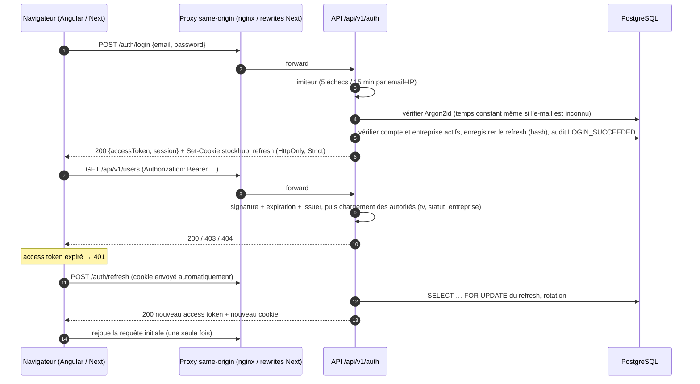

# Sécurité

## Principes

1. **Le backend est l'unique autorité.** Les frontends masquent des actions, mais chaque requête est ré-autorisée côté serveur.
2. **L'entreprise courante vient du token**, jamais de la requête. Une ressource d'une autre entreprise renvoie **404** (et non 403), pour ne pas révéler son existence.
3. **Aucun droit n'est transporté dans le JWT.** Il ne contient que `sub` (utilisateur), `cid` (entreprise) et `tv` (version du token). Rôle, permissions et emplacements sont rechargés côté serveur à chaque requête (cache de 60 s, invalidé à chaque changement).
4. **Défense en profondeur** : règle d'URL (`/api/v1/platform/**` réservée au `SUPER_ADMIN`), `@PreAuthorize` avec permission sur chaque endpoint, filtre de tenant dans chaque requête SQL, et `LocationAccessPolicy` pour les emplacements.

## Jetons

| Jeton | Format | Durée | Stockage client | Stockage serveur |
|---|---|---|---|---|
| Access token | JWT HS512 (clé ≥ 512 bits) | 15 min | mémoire JS uniquement | — |
| Refresh token | 256 bits aléatoires, opaque | 7 jours | cookie `HttpOnly; Secure; SameSite=Strict; Path=/api/v1/auth` | empreinte SHA-256 uniquement |

- **Rotation** : chaque refresh émet un nouveau couple de jetons. L'ancien refresh est révoqué (`ROTATED`).
- **Détection de vol** : présenter un refresh déjà utilisé révoque toute la famille (`REUSE_DETECTED`) et l'événement est audité.
- **Révocation immédiate** : désactivation de l'utilisateur, changement ou réinitialisation du mot de passe → `token_version` + 1. Les access tokens en cours deviennent invalides et les refresh de l'ancienne version sont révoqués.
- **Entreprise désactivée** : login, refresh et toute requête sont refusés (vérification à chaque requête).
- **Mot de passe temporaire** : l'utilisateur n'a *aucune* permission tant qu'il ne l'a pas changé.

## Flux d'authentification

Côté frontend, les 401 concurrents partagent **un seul** appel de refresh (*single flight*). Si ce refresh échoue, la session est effacée et l'utilisateur est redirigé vers la page de login avec `returnUrl`. Seuls les chemins relatifs à l'application sont acceptés comme `returnUrl`, ce qui empêche les redirections ouvertes.

## Mots de passe

- Hachage **Argon2id** (paramètres Spring Security 5.8 conformes OWASP).
- Politique : 10 à 128 caractères, lettres et chiffres, ne doit pas contenir l'identifiant de l'e-mail.
- Le super admin est créé au démarrage à partir de variables d'environnement. Aucun identifiant n'est présent dans les migrations.

## Audit

Les actions sensibles sont écrites dans `audit_logs` **dans la même transaction** que l'action : une action validée a toujours sa trace. Les échecs de connexion et les réutilisations de refresh sont écrits dans une transaction séparée, pour survivre au rejet de la requête. La table rejette tout `UPDATE` ou `DELETE` grâce à un trigger PostgreSQL.

Chaque ligne contient : entreprise, utilisateur et e-mail de l'acteur, action, type et identifiant de l'entité, valeurs avant et après (JSON, sans secret), métadonnées, IP, user-agent et `X-Request-Id`.

## En-têtes et exposition

- API : `Content-Security-Policy` stricte, `Referrer-Policy: no-referrer`, pas de session HTTP, CSRF sans objet (bearer + cookie `SameSite=Strict` limité à `/api/v1/auth`).
- Frontends : `X-Content-Type-Options`, `X-Frame-Options: DENY`, `Permissions-Policy` (caméra autorisée pour le scanner uniquement).
- Les erreurs ne contiennent jamais de stack trace (`server.error.include-stacktrace: never` et gestionnaire global). Chaque erreur porte un `requestId` pour le support.
- Les journaux ne contiennent ni mot de passe ni token (`LoginRequest.toString()` masqué, seules les empreintes des refresh tokens sont stockées).

## Tests de sécurité automatisés

`AuthFlowIntegrationTest`, `ApiSecurityIntegrationTest`, `TenantIsolationIntegrationTest`, `UserManagementIntegrationTest`, `CompanyOnboardingIntegrationTest` (PostgreSQL réel via Testcontainers) couvrent notamment :
JWT absent, malformé, expiré, signé avec une autre clé, d'un utilisateur inconnu ou d'une version révoquée ; 403 par permission ; 404 inter-entreprises en lecture et en écriture ; entreprise et utilisateur désactivés ; rotation et réutilisation du refresh ; verrouillage après échecs ; mot de passe temporaire sans permission ; impossibilité d'attribuer `SUPER_ADMIN`.
